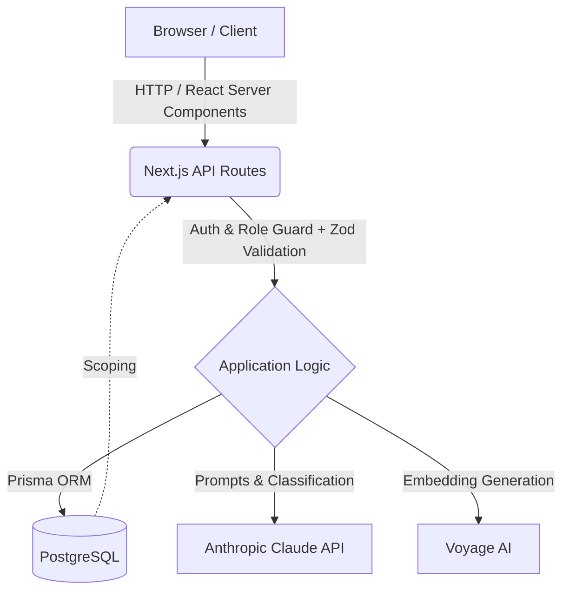

# Project LOOP: AI Customer-Feedback Intelligence Platform

## 1. Project Overview
**LOOP** is a state-of-the-art AI-powered platform designed to turn scattered customer feedback into ranked, evidence-backed insights. Built with a focus on robust multi-tenant architecture and security, LOOP processes feedback to automatically extract themes, sentiment, trends, and grounded answers.

Key Features:
* **Multi-tenant Workspaces**: Secure, isolated environments for different organizations.
* **Role-Based Access Control**: Granular permissions (Admin, Analyst, Viewer).
* **AI Auto-classification**: Sentiment analysis, scoring, and feature area categorization using Claude API.
* **Theme Clustering & Trends**: Automated identification of feedback volume spikes and trends.
* **Ask LOOP**: Semantic retrieval system for answering natural language queries based exclusively on stored workspace data.

## 2. Technology Stack
The platform leverages a modern, scalable web stack:

* **Frontend & Framework**: Next.js 14 (App Router), React, TypeScript
* **Styling & UI**: Tailwind CSS, Recharts for data visualization, Lucide React for icons
* **Database & ORM**: PostgreSQL (Neon/Supabase), Prisma ORM
* **Authentication**: NextAuth (Auth.js) with JWT sessions
* **Artificial Intelligence**: 
  * *Anthropic Claude API* for text classification and report generation
  * *Voyage AI* (voyage-3) for embeddings and semantic retrieval
* **Validation**: Zod (for end-to-end type safety and API boundaries)

## 3. Architecture & Data Flow

LOOP employs a secure, three-tier architectural model to ensure data privacy and performant AI operations. The client never interacts directly with the AI providers; all requests are proxied through secure Next.js API routes.

**Security & Scalability Highlights**:
* **Workspace Isolation**: Every database query is strictly scoped by `workspaceId`.
* **Server-side AI**: API keys for Claude and Voyage are securely stored on the server.
* **Semantic Search**: Text embeddings are stored and queried using cosine similarity to power the *Ask LOOP* feature.

## 4. Conclusion
Project LOOP provides a highly professional, scalable solution for transforming raw, unorganized customer feedback into actionable business intelligence. By effectively combining the robust Next.js ecosystem with cutting-edge Large Language Models (LLMs) and semantic search algorithms, it establishes a reliable pipeline for Voice-of-Customer reporting, deep analytics, and strategic product insights.

<!-- End of documentation -->
